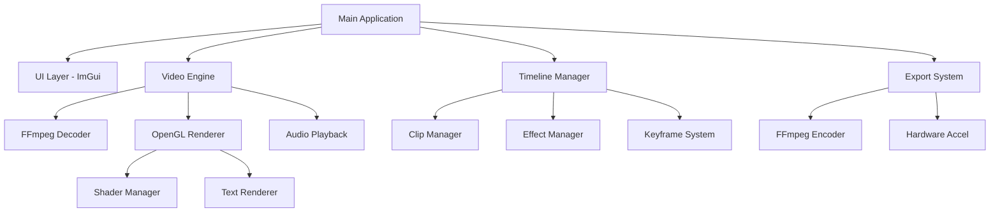

# CapCut Clone - Development Roadmap

A comprehensive video editing application built with C++, featuring timeline-based editing, effects, and professional export capabilities.

## Project Overview

This project aims to create a full-featured video editor similar to CapCut, with a modern UI, real-time preview, and professional-grade editing tools.

## Development Phases

### 📋 Phase 1: UI Foundation with ImGui

**Goal**: Create the core user interface with interactive controls

**Key Features**:
- ✅ Main application window setup
- ✅ Menu bar (File, Edit, View, Export)
- ✅ Timeline panel with zoom controls
- ✅ Video preview panel
- ✅ Properties/Effects panel with sliders and buttons
- ✅ File browser dialog
- ✅ Playback controls (Play, Pause, Stop, Seek)

**Libraries**:
- **ImGui**: Immediate mode GUI framework
- **GLFW**: Window and input handling
- **GLAD**: OpenGL loader

**Implementation Steps**:
1. Initialize GLFW window with OpenGL context
2. Set up ImGui rendering backend
3. Create dockable window layout
4. Implement basic controls (buttons, sliders, input fields)
5. Add keyboard shortcuts (Space for play/pause, Arrow keys for frame navigation)

**Deliverables**:
- Working GUI application with responsive layout
- Basic navigation and control system
- Saved layout preferences

---

### 🎬 Phase 2: Video Loading & Playback

**Goal**: Load and play video files with real-time preview

**Key Features**:
- ✅ Load video files (MP4, AVI, MOV, MKV)
- ✅ Decode video frames using FFmpeg
- ✅ Display frames as OpenGL textures
- ✅ Play/Pause/Stop controls
- ✅ Frame-by-frame navigation
- ✅ Timeline scrubbing
- ✅ Audio playback synchronization

**Libraries**:
- **FFmpeg**: Video decoding and demuxing
- **OpenGL**: Texture rendering for video frames
- **OpenAL/PortAudio**: Audio playback (optional for Phase 2)

**Implementation Steps**:
1. Create video decoder class using FFmpeg's `libavcodec` and `libavformat`
2. Implement frame buffer/queue system
3. Convert video frames (YUV/RGB) to OpenGL textures
4. Create playback controller with timer-based frame updates
5. Add seek functionality to jump to specific timestamps
6. Implement audio decoding and synchronization

**Technical Details**:
```cpp
// Example structure
class VideoPlayer {
    AVFormatContext* formatContext;
    AVCodecContext* codecContext;
    GLuint textureID;
    double currentTime;
    bool isPlaying;
    
    void loadVideo(const char* filepath);
    void decodeNextFrame();
    void renderFrame();
    void seek(double timestamp);
};
```

**Deliverables**:
- Functional video player with smooth playback
- Timeline that reflects current playback position
- Support for multiple video formats

---

### ✂️ Phase 3: Timeline & Editing Logic

**Goal**: Implement video trimming, splitting, and merging capabilities

**Key Features**:
- ✅ Visual timeline with video clips
- ✅ Trim clips (adjust in/out points)
- ✅ Split clips at playhead position
- ✅ Drag & drop clips on timeline
- ✅ Multi-track support (video + audio tracks)
- ✅ Merge/concatenate multiple clips
- ✅ Clip deletion and rearrangement
- ✅ Undo/Redo system

**Libraries**:
- **Timeline Logic**: Custom implementation
- **STL**: Vector, list for clip management

**Implementation Steps**:
1. Design timeline data structure (tracks, clips, effects)
2. Implement clip class with in/out points and transformations
3. Create timeline renderer in ImGui
4. Add drag-and-drop functionality for clip rearrangement
5. Implement trim handles (visual indicators for in/out points)
6. Build command pattern for undo/redo operations
7. Create clip merging algorithm (concatenation without re-encoding)

**Technical Details**:
```cpp
struct Clip {
    std::string filepath;
    double startTime;    // Position on timeline
    double duration;
    double inPoint;      // Trim start
    double outPoint;     // Trim end
    int trackIndex;
};

class Timeline {
    std::vector<std::vector<Clip>> tracks;
    std::stack<Command*> undoStack;
    std::stack<Command*> redoStack;
    
    void addClip(Clip clip);
    void removeClip(int trackIndex, int clipIndex);
    void splitClip(int trackIndex, int clipIndex, double time);
    void mergeClips(std::vector<Clip>& clips);
};
```

**Deliverables**:
- Interactive timeline with multi-track editing
- Full trimming and splitting capabilities
- Robust undo/redo system

---

### 🎨 Phase 4: Effects & Text Overlay

**Goal**: Add visual effects, color grading, and text capabilities

**Key Features**:
- ✅ Color filters (Brightness, Contrast, Saturation, Hue)
- ✅ GLSL shader effects (Blur, Sharpen, Vignette, Grayscale)
- ✅ Text overlay with custom fonts
- ✅ Text animations (Fade in/out, Slide)
- ✅ Keyframe system for animated effects
- ✅ Effect presets library
- ✅ Real-time preview of effects

**Libraries**:
- **GLSL Shaders**: Custom fragment shaders for effects
- **FreeType**: Font rendering
- **stb_truetype**: Alternative font library

**Implementation Steps**:
1. Create shader manager for loading and compiling GLSL shaders
2. Implement color adjustment shaders (brightness, contrast, saturation)
3. Add advanced effect shaders (blur, sharpen, edge detection)
4. Integrate FreeType for text rendering
5. Create text overlay system with positioning and styling
6. Build keyframe interpolation system
7. Design effects panel UI with real-time parameter adjustment

**GLSL Shader Examples**:
```glsl
// Brightness/Contrast Shader
uniform sampler2D uTexture;
uniform float uBrightness;  // -1.0 to 1.0
uniform float uContrast;    // 0.0 to 2.0

void main() {
    vec4 color = texture2D(uTexture, vTexCoord);
    color.rgb += uBrightness;
    color.rgb = (color.rgb - 0.5) * uContrast + 0.5;
    gl_FragColor = color;
}
```

**Text Rendering Structure**:
```cpp
class TextOverlay {
    FT_Library ftLibrary;
    FT_Face fontFace;
    std::string text;
    glm::vec2 position;
    glm::vec4 color;
    float fontSize;
    
    void loadFont(const char* fontPath);
    void renderText(const std::string& text);
    void setKeyframe(double time, TextProperties props);
};
```

**Deliverables**:
- Library of color and visual effects
- Text overlay system with custom fonts
- Keyframe animation support

---

### 💾 Phase 5: Export & Hardware Acceleration

**Goal**: Export edited videos with optimized encoding

**Key Features**:
- ✅ Multiple export formats (MP4, AVI, MOV, WebM)
- ✅ Resolution presets (720p, 1080p, 4K)
- ✅ Codec selection (H.264, H.265/HEVC, VP9)
- ✅ Hardware acceleration (NVIDIA NVENC, Intel Quick Sync, AMD VCE)
- ✅ Quality settings (bitrate, CRF)
- ✅ Export progress bar with ETA
- ✅ Background export (non-blocking)
- ✅ Export queue system

**Libraries**:
- **FFmpeg**: Video encoding with hardware acceleration
- **libx264/libx265**: Software encoding fallback

**Implementation Steps**:
1. Build export settings dialog (format, resolution, codec, quality)
2. Implement video encoder class using FFmpeg's `libavcodec`
3. Add hardware acceleration detection and initialization
4. Create frame pipeline: Timeline → Effects → Encoder
5. Implement progress tracking and cancellation
6. Add multi-threaded export for better performance
7. Create export preset system (YouTube, Instagram, TikTok)

**Hardware Acceleration Setup**:
```cpp
class VideoEncoder {
    AVCodecContext* codecContext;
    AVFormatContext* outputContext;
    bool useHardwareAccel;
    
    void initHardwareAccel() {
        // Try NVENC (NVIDIA)
        const AVCodec* codec = avcodec_find_encoder_by_name("h264_nvenc");
        if (!codec) {
            // Try Quick Sync (Intel)
            codec = avcodec_find_encoder_by_name("h264_qsv");
        }
        if (!codec) {
            // Fallback to software
            codec = avcodec_find_encoder_by_name("libx264");
        }
    }
    
    void encodeFrame(AVFrame* frame);
    void finalize();
};
```

**Export Presets**:
```cpp
struct ExportPreset {
    std::string name;
    int width, height;
    std::string codec;
    int bitrate;
    int fps;
};

// Example presets
presets["YouTube 1080p"] = {1920, 1080, "h264_nvenc", 8000000, 30};
presets["Instagram"] = {1080, 1350, "h264_nvenc", 5000000, 30};
presets["TikTok"] = {1080, 1920, "h264_nvenc", 6000000, 30};
```

**Deliverables**:
- Full export system with multiple formats
- Hardware-accelerated encoding
- Export queue and progress tracking

---

## Additional Features (Future Enhancements)

### Advanced Editing
- [ ] Transitions (Fade, Dissolve, Wipe, Slide)
- [ ] Picture-in-Picture (PiP)
- [ ] Green screen / Chroma key
- [ ] Speed control (Slow motion, Time-lapse)
- [ ] Reverse playback

### Audio Features
- [ ] Audio waveform visualization
- [ ] Volume adjustment and fade
- [ ] Audio effects (Echo, Reverb, Equalizer)
- [ ] Background music library
- [ ] Voiceover recording

### Advanced Effects
- [ ] Stabilization
- [ ] Motion tracking
- [ ] 3D LUT color grading
- [ ] Particle effects
- [ ] Mask/Rotoscoping tools

### Professional Tools
- [ ] Multi-camera editing
- [ ] Proxy workflow for 4K editing
- [ ] Collaborative editing (cloud sync)
- [ ] Plugin system for third-party effects
- [ ] Script-based automation

---

## Technical Architecture

### Core Components



### Data Flow

1. **Input**: Video files loaded via FFmpeg
2. **Processing**: Frames processed through effect pipeline
3. **Rendering**: OpenGL renders frames with effects/text
4. **Output**: FFmpeg encodes final video with hardware acceleration

---

## Development Timeline

| Phase | Estimated Time | Complexity |
|-------|---------------|------------|
| Phase 1: UI Foundation | 1-2 weeks | Medium |
| Phase 2: Video Playback | 2-3 weeks | High |
| Phase 3: Timeline Editing | 3-4 weeks | High |
| Phase 4: Effects & Text | 2-3 weeks | Medium |
| Phase 5: Export System | 1-2 weeks | Medium |

**Total Estimated Time**: 9-14 weeks

---

## Testing Strategy

### Unit Tests
- Clip manipulation functions
- Timeline operations
- Effect parameter validation

### Integration Tests
- Video loading and playback
- Timeline rendering
- Export pipeline

### Performance Tests
- 4K video playback smoothness
- Effect rendering FPS
- Export speed benchmarks

---

## Resources & References

- [FFmpeg Documentation](https://ffmpeg.org/documentation.html)
- [ImGui Examples](https://github.com/ocornut/imgui/wiki)
- [OpenGL Tutorial](https://learnopengl.com/)
- [FreeType Documentation](https://freetype.org/freetype2/docs/documentation.html)
- [GLSL Shader Examples](https://www.shadertoy.com/)

---

## Getting Started

1. Complete the setup from `CPP_INSTALL_GUIDE.md`
2. Start with Phase 1: Create basic UI layout
3. Follow each phase sequentially
4. Test thoroughly after each phase
5. Iterate and refine based on feedback

**Let's build an amazing video editor! 🚀**
